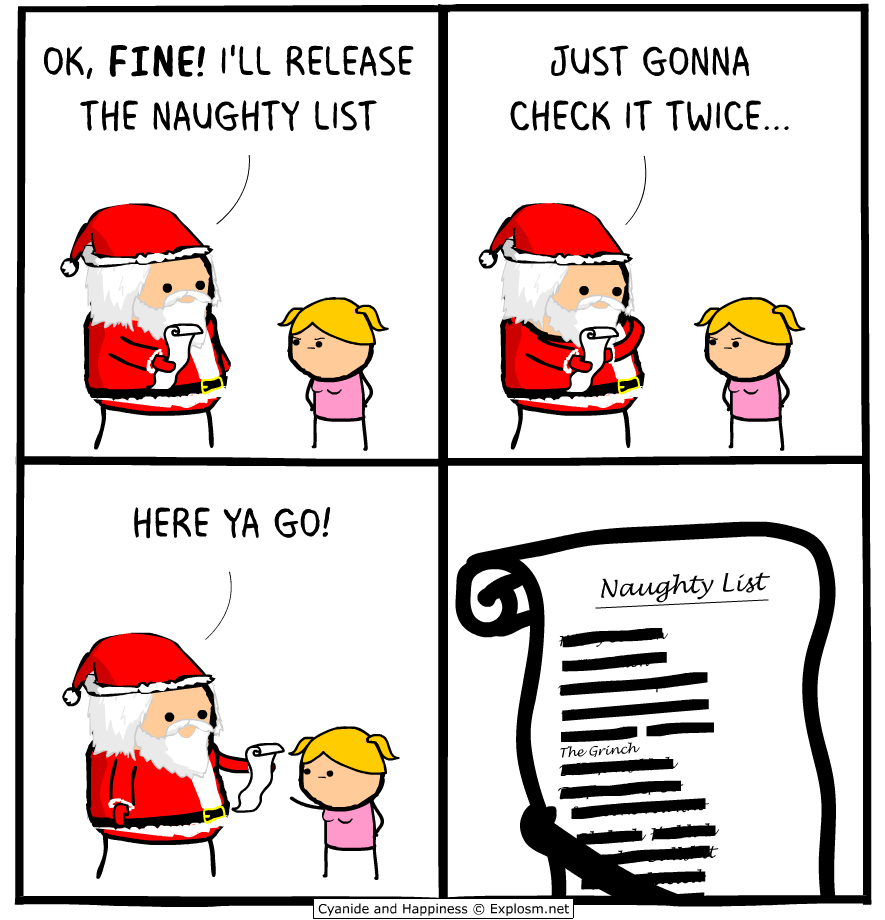
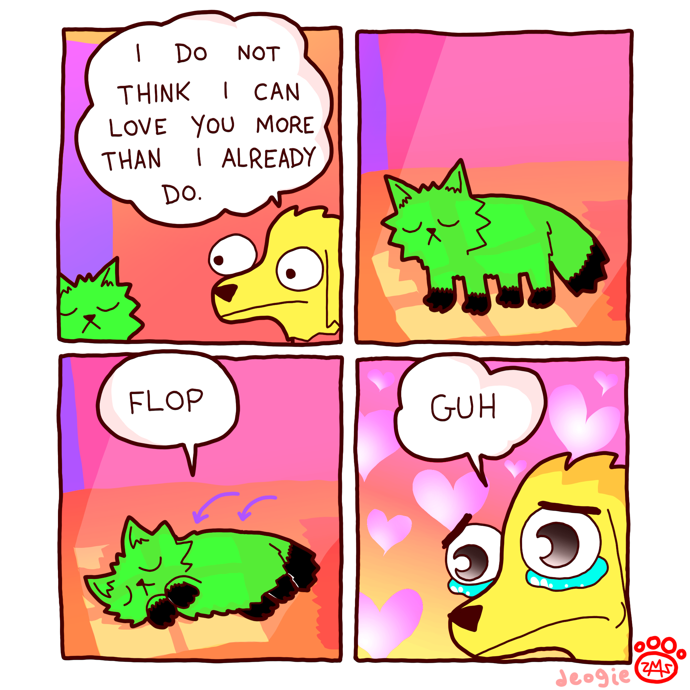
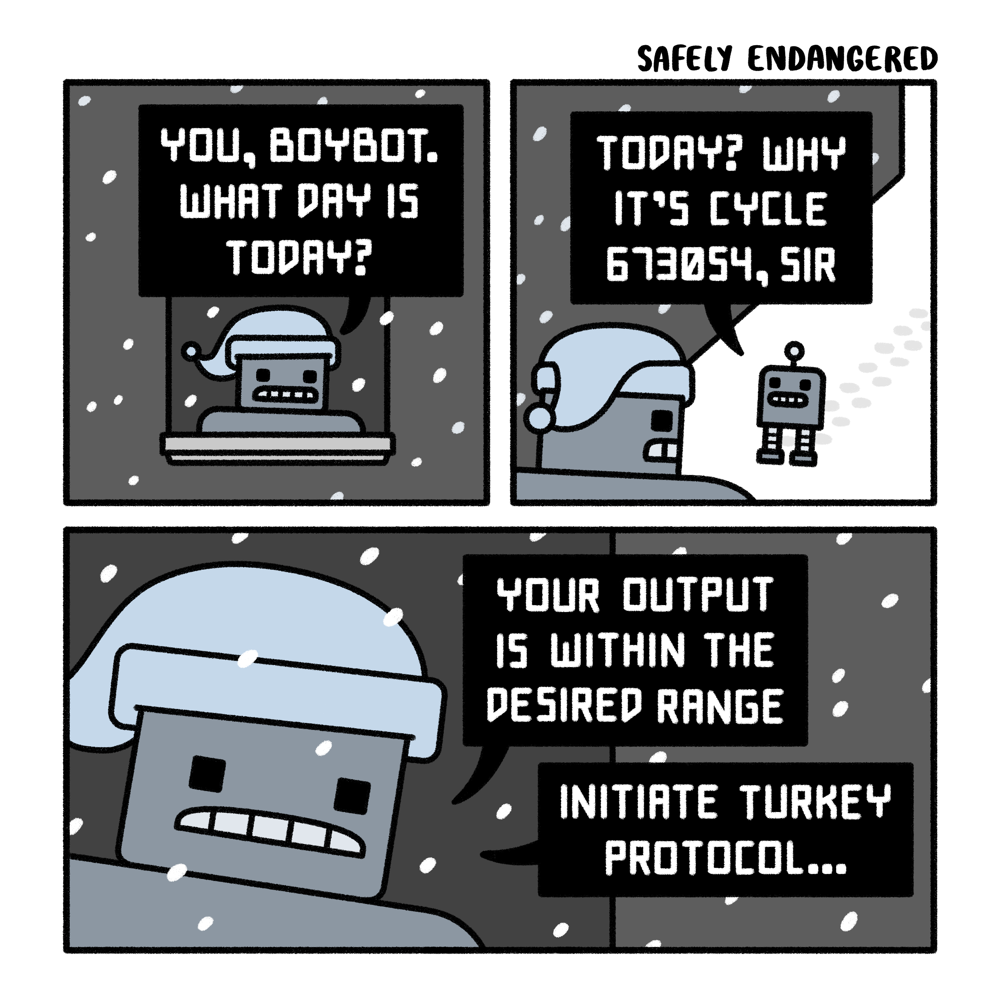
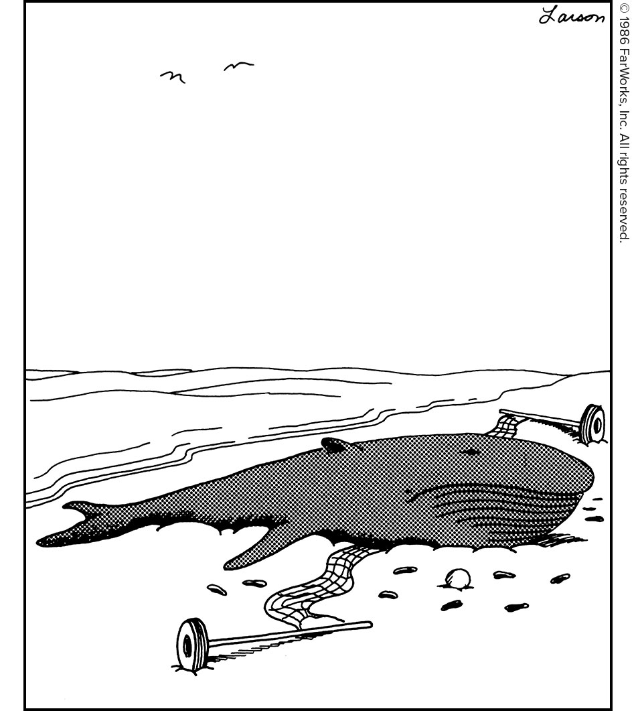

# Comics Daily 📰🎨
A collection of daily web comics from various sources.
## Latest Comics
*Last updated: 2025-12-18 19:00:32*
---
### [Extra Ordinary Comics](https://www.exocomics.com/)
**Date:** 2025-12-18

---
### [Cyanide & Happiness](https://explosm.net/)
**Date:** 2025-12-18

---
### [Extrafabulous](#)
**Date:** 2025-12-05

---
### [Poorly Drawn Lines](https://poorlydrawnlines.com/)
**Date:** 2025-12-18

---
### [Dinosaur Comics](https://qwantz.com/)
**Date:** 2025-12-18

---
### [Safely Endangererd](#)
**Date:** 2025-12-17

---
### [Saturday Morning Breakfast Cereal](https://www.smbc-comics.com/)
**Date:** 2025-12-04

---
### [Thefarside](#)
**Date:** 2025-12-18

---
### [XKCD](https://xkcd.com/)
**Date:** 2025-12-18

---

## About
This repository aggregates daily comics from multiple web comic sources. Each comic is automatically fetched and stored in the central data directory.

## Comic Sources
- [Extra Ordinary Comics](https://www.exocomics.com/) - [Repository](https://github.com/AI-Enthusiast/exocomics-daily)
- [Cyanide & Happiness](https://explosm.net/) - [Repository](https://github.com/AI-Enthusiast/explosm-daily)
- [Extrafabulous](#) - [Repository](https://github.com/AI-Enthusiast/extrafabulous-daily)
- [Poorly Drawn Lines](https://poorlydrawnlines.com/) - [Repository](https://github.com/AI-Enthusiast/poorlydrawnlines-daily)
- [Dinosaur Comics](https://qwantz.com/) - [Repository](https://github.com/AI-Enthusiast/qwantz-daily)
- [Safely Endangererd](#) - [Repository](https://github.com/AI-Enthusiast/safely_endangererd-daily)
- [Saturday Morning Breakfast Cereal](https://www.smbc-comics.com/) - [Repository](https://github.com/AI-Enthusiast/smbc-daily)
- [Thefarside](#) - [Repository](https://github.com/AI-Enthusiast/thefarside-daily)
- [XKCD](https://xkcd.com/) - [Repository](https://github.com/AI-Enthusiast/xkcd-daily)

## Structure
```
comics-daily/
├── bin/           # Scripts and utilities
├── data/          # Latest comics (centralized)
├── src/           # Comic scraper repositories
│   ├── explosm-daily/
│   ├── xkcd-daily/
│   ├── exocomics-daily/
│   ├── smbc-daily/
│   ├── poorlydrawnlines-daily/
│   └── qwantz-daily/
└── README.md      # This file
```

## Usage
To clone all comic repositories:
```bash
./bin/init_pull.sh
```

To update this README with the latest comics:
```bash
python3 src/update_readme.py
```

---
*This README is automatically generated. Comics are property of their respective creators.*
